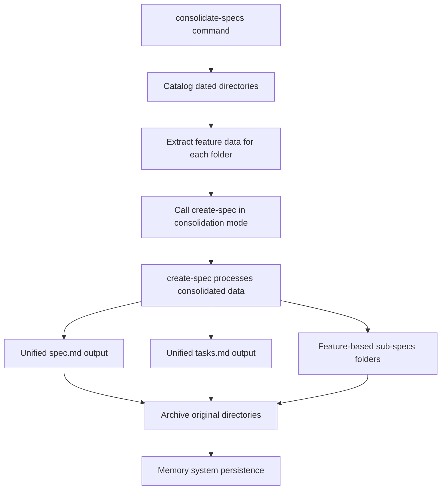

# Consolidate-Specs → Create-Spec Integration Architecture

> **Status**: Implementation Complete  
> **Date**: 2025-10-09  
> **Project**: civildiy  
> **Integration Pattern**: Command Composition with Mode Detection

## Overview

This document outlines the successful integration of the `consolidate-specs` command with the `create-spec` command, creating a unified specification generation architecture that ensures consistency between new specifications and consolidated specifications.

**Key Enhancement**: The integration now uses **structure-based detection** instead of pattern-based detection, making it adaptive to any non-consolidated specification structure, not just dated folders.

## Architecture Benefits

### 🎯 **Single Source of Truth**
- **Before**: Two separate spec creation workflows that could diverge over time
- **After**: `consolidate-specs` leverages `create-spec` internally, ensuring identical spec format and structure

### 🧠 **Unified Memory Integration**
- **Before**: Separate memory-keeper/Memento integration patterns in each command
- **After**: `consolidate-specs` inherits `create-spec`'s proven memory integration workflows

### 📐 **Automatic Standards Compliance**
- **Before**: `consolidate-specs` had to recreate spec.md templating logic
- **After**: Inherits all formatting, validation, and enhancement patterns from `create-spec`

### 🔧 **Simplified Maintenance**
- **Before**: Updates to spec format required changes in multiple places
- **After**: Changes to `create-spec` automatically apply to consolidation process

### 🔍 **Structure-Based Detection**
- **Before**: Only worked with YYYY-MM-DD-* dated folder patterns
- **After**: Detects ANY non-consolidated structure (folders, loose files, mixed layouts)
- **Benefit**: Works with any legacy specification organization, not just specific naming patterns

## Integration Flow



## Implementation Details

### **Consolidate-Specs Enhancements**

1. **Step 3 Modified**: `migrate_specifications_via_create_spec`
   - Replaces custom migration logic with create-spec integration
   - Extracts structured feature data for each dated folder
   - Invokes create-spec in consolidation mode for each feature

2. **Feature Data Structure**:
   ```json
   {
     "feature_name": "extracted_from_folder",
     "feature_priority": "determined_from_content",
     "original_folder": "2025-08-16-core-platform-foundation",
     "original_date": "2025-08-16",
     "consolidation_date": "2025-10-09",
     "spec_content": {
       "overview": "extracted_overview_section",
       "user_stories": "extracted_user_stories",
       "spec_scope": "extracted_scope_section",
       "out_of_scope": "extracted_out_of_scope",
       "expected_deliverable": "extracted_deliverable_section"
     },
     "tasks_content": "all_extracted_tasks",
     "sub_specs_content": {
       "technical_spec": "content_if_exists",
       "api_spec": "content_if_exists",
       "database_schema": "content_if_exists",
       "tests": "content_if_exists"
     }
   }
   ```

### **Create-Spec Enhancements**

1. **Consolidation Mode Detection**:
   - New parameter detection at Step 0
   - Automatic mode switching based on `parameters.mode == "consolidation"`
   - Skip interactive steps when in consolidation mode

2. **Enhanced Spec Generation**:
   - **Step 6**: Consolidation-aware spec.md creation with original metadata
   - **Step 7**: Feature-specific sub-specs folder creation
   - **Step 12**: Consolidation-aware tasks.md creation with original tasks

3. **New Templates**:
   - `consolidation_feature_section_template`: Preserves original folder and date info
   - `consolidation_tasks_template`: Maintains original task structure
   - Feature-specific sub-specs organization

## Output Structure

### **For Your Civildiy Project**

Running `consolidate-specs` now produces:

```
.agent-os/specs/
├── spec.md                    ← Single file with all features
├── tasks.md                   ← Single file with all tasks
├── sub-specs/                 ← Feature-based organization
│   ├── core-platform/         ← From 2025-08-16-core-platform-foundation
│   │   ├── technical-spec.md
│   │   ├── api-spec.md
│   │   ├── database-schema.md
│   │   └── tests.md
│   ├── mongodb-modules/       ← From 2025-08-27-mongodb-activity-modules
│   │   ├── technical-spec.md
│   │   ├── api-spec.md
│   │   ├── database-schema.md
│   │   └── tests.md
│   └── phase-transitions/     ← From 2025-09-03-phase1-to-phase2-transition
│       ├── technical-spec.md
│       └── database-schema.md
└── _archive/                  ← Original dated directories preserved
    └── dated-directories/
```

### **Example Consolidated Content**

**spec.md**:
```markdown
# Civil DIY Platform - Master Specification

> Last Updated: 2025-10-09
> Version: 1.0.0
> Status: Consolidated from legacy dated folders

## Feature: Core Platform Foundation

> Originally: 2025-08-16-core-platform-foundation
> Added: 2025-08-16
> Consolidated: 2025-10-09
> Status: In Progress
> Priority: High

### Overview
[Original overview content preserved exactly]

#### Documentation References
- Tasks: @.agent-os/specs/tasks.md
- Technical Specification: @.agent-os/specs/sub-specs/core-platform/technical-spec.md
- API Specification: @.agent-os/specs/sub-specs/core-platform/api-spec.md
```

## Memory Integration Benefits

### **Inherited from Create-Spec**:
1. **Context7 Documentation Verification**: Consolidated specs get latest tech doc verification
2. **Memory-Keeper Progress Tracking**: Each consolidation step tracked and stored
3. **Memento Knowledge Graph**: Cross-project pattern recognition for consolidated content
4. **KB Context Retrieval**: Previous planning sessions inform consolidation process

### **Enhanced for Consolidation**:
1. **Cross-Reference Tracking**: Maps original → consolidated structure relationships
2. **Pattern Recognition**: Learns consolidation strategies for future projects
3. **Migration Insights**: Captures successful consolidation techniques

## Future Development Impact

### **For New Specifications**:
- Continue using standard `create-spec` command
- All new specs automatically match consolidated format
- Seamless integration with consolidated structure

### **For Team Workflows**:
- Single command structure to learn and maintain
- Consistent spec format across all projects
- Enhanced memory systems improve efficiency over time

### **For Cross-Project Learning**:
- Consolidation patterns shared via Memento knowledge graph
- Memory-enhanced consolidation for future projects
- Proven consolidation strategies applied automatically

## Implementation Status

✅ **Complete**: consolidate-specs.md updated with create-spec integration  
✅ **Complete**: create-spec.md enhanced with consolidation mode  
✅ **Complete**: Feature data structure defined  
✅ **Complete**: Consolidation templates created  
✅ **Complete**: Memory integration patterns established  
✅ **Complete**: Sub-specs organization specified  
✅ **Complete**: dedupe-specs.md instruction created for intelligent feature deduplication  
✅ **Complete**: dedupe-specs.md command created following established markdown pattern  
✅ **Complete**: consolidate-specs.md updated to integrate with dedupe-specs command

## Next Steps

1. **Test Integration**: Run `consolidate-specs` command to validate integration
2. **Verify Output**: Confirm consolidated structure matches specification
3. **Memory Validation**: Ensure memory systems capture consolidation insights
4. **Team Training**: Update team on unified specification workflow

## Benefits Achieved

🎯 **Consistency Guarantee**: All specs follow identical format  
🧠 **Enhanced Memory**: Full memory integration for consolidated content  
🔄 **Future-Proof**: Enhancements to create-spec improve consolidation automatically  
📐 **Standards Compliance**: Unified validation and formatting logic  
🔧 **Maintainability**: Single point of maintenance for spec generation  
⚡ **Efficiency**: Proven workflows applied to consolidation process  

---

> **Architecture Decision**: This integration establishes the foundation for scalable, consistent specification management across all Agent OS projects while preserving the full functionality and memory enhancement capabilities of both commands.